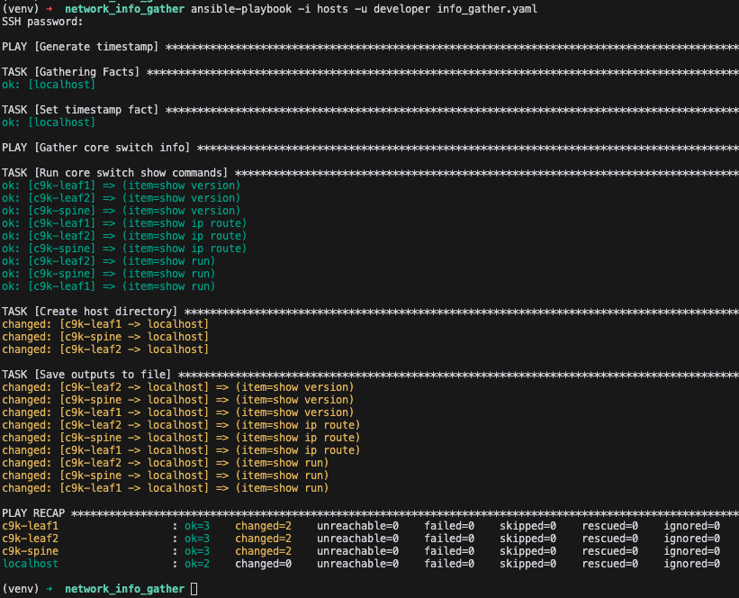

# Overview
This is a simple example of using Ansible to gather show commands from your Cisco IOS devices. 

## Prerequisites
- Python 3 installed on your system

## Setup Instructions
1. Create a Python virtual environment:
   ```
   python3 -m venv venv
   ```

2. Activate the virtual environment:
   - On Linux or MacOS:
     ```
     source venv/bin/activate
     ```

3. Install Ansible
   ```
   python3 -m pip install ansible
   ```

4. Install the Ansible Galaxy collection for Cisco IOS:
   ```
   ansible-galaxy collection install cisco.ios
   ```

Now you're ready to start using Ansible for network automation with Cisco IOS devices!

## Structure and Usage
There are various different ways you can structure your hosts, groups, variables etc. In this instance as a quick example, I've provided all the "show" commands in the commands.yaml file. The hosts are defined in the ini-style format "hosts" file, where they are grouped based on core_switches, access_switches or all_switches (a group of groups). I've also kept it simple for now, but including some variables within the actual hosts file, as you start to use Ansible more, you'll want to start splitting things out in a cleaner, more scalable fashion.

The playbook (info_gather.yaml) targets "all" hosts (a hidden, default group name), but can be tweaked as necessary.

To run the playbook, use the command `ansible-playbook -i hosts -u <your_username> info_gather.yaml`. The ansible.cfg has been set to explicitly ignore the host key checks (in case you've not SSH'd to these devices before), and to prompt for your username and password.

